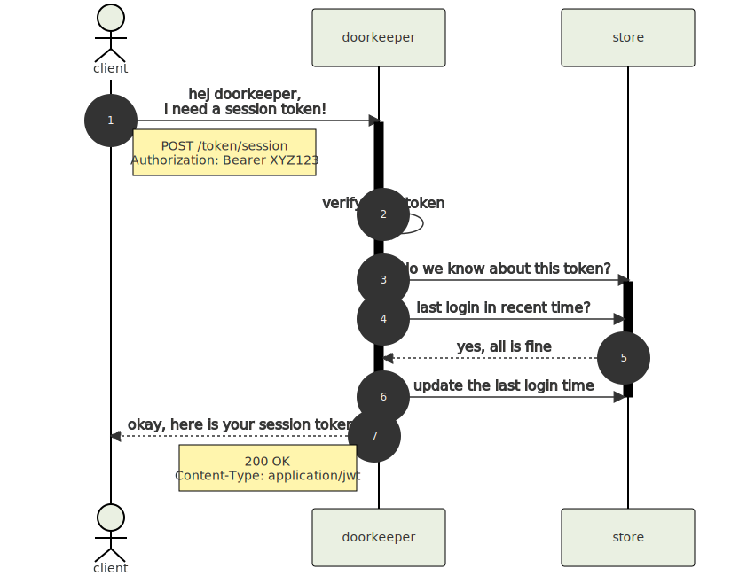

# doorkeeper

A simple and unobtrusive token management service.

This is a [RESTful](https://en.wikipedia.org/wiki/Representational_state_transfer) web service, written in javascript and built on top of [Node.js](https://nodejs.org/)

As token database backend an internal _in memory store_ (development) can be used or alternatively a [redis](https://redis.io/) store (production).


## Table of Contents

1. [Table of Contents](#table-of-contents)
2. [How it works](#how-it-works)
   1. [Login via password](#login-via-password)
   2. [Create session token](#create-session-token)
3. [Service Endpoints](#service-endpoints)
   1. [Create Token _aka_ LOGIN](#create-token-aka-login)
   2. [Verify Token](#verify-token)
   3. [Destroy All Tokens](#destroy-all-tokens)
4. [Development](#development)
   1. [Setup](#setup)
   2. [Testing](#testing)
   3. [Run a local server](#run-a-local-server)
   4. [Build docker image](#build-docker-image)


## How it works

### Login via password


### Create session token




## Service Endpoints

---

### Create Token _aka_ LOGIN

```
POST /token
```

| parameter | type | in | description |
|-----------|------|----|-------------|
| `login` | string | body | login id |
| `password` | string | body | login secret |

Create a new token. You will need to send the `login` and `password` parameters.
The service will accept the parameters only as _form_ or _json_ encoded body data.

Returns a _signed_ [jwt token](https://jwt.io/).

---

### Verify Token

```
GET /token
```

Verify and return the token payload as json.

You need to pass your token as header parameter: `Authorization: Bearer XYZ123`.

| parameter | type | in | description |
|-----------|------|----|-------------|
| `Authorization` | string | header | jwt token |

Returns the token payload data as *json* object. Returns with an error (`400 Bad Request`) if the token can not be verified.

---

### Destroy All Tokens

```
DELETE /tokens
```

Destroy all tokens.

You need to pass your token as header parameter: `Authorization: Bearer xyz123`.

| parameter | type | in | description |
|-----------|------|----|-------------|
| `Authorization` | string | header | jwt token |

> :warning: SECURITY NOTE: for this api call the `admin` role must be present in the token data props under the `roles` key!

---

## Development

### Setup

As a prerequisite, you need a **node v16+** and a current **docker** environment installed.

```sh
$ npm install
```

### Testing

Run `npm test` for running all tests from [test/*](test) against the local in-memory database.

Using `npm run test:redis:run` will use *docker-compose* to run all tests against a dockerized redis instance.

Or just use `npm run test:all` to run all tests against both environments (intended for ci).

For development `npm run test:watch` is meant, which _only_ test against the in-memory database, but restarts the tests every time the sources have changed. very useful for development 😉

> :point_right: NOTE: at the moment we use _mocha_ as test runner and not _jest_ because _jest_ support for native es6 imports is still experimental AND _jest_ runs incredibly slow in a docker context 😢

### Run a local server

In order to run a local server, you need to start a redis instance:

```sh
$ npm run dev:redis:up
```

After that, you can start a local server with:

```sh
$ npm start
# .. or use:
$ npm run watch
```

This will start a server listening on http://localhost:6100 and restart the application when a source file changed.

> for the very lazy `npm run dev` is meant ... this starts both a redis instance and then immediately the server in watch mode


### Build docker image

To create a release version and build the docker image, simply run:

```sh
$ npm run docker:build
```

Start the docker container with `npm run docker:run` (or use `docker:start` which starts the doorkeeper service in the background) or run an interactive shell session via `npm run docker:run:shell`


have fun 🚀
