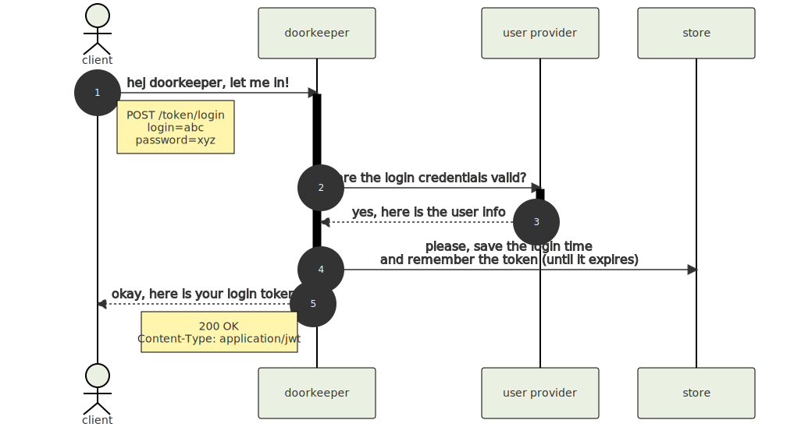

# doorkeeper

> A simple and unobtrusive token management µ-service

This is a [RESTful](https://en.wikipedia.org/wiki/Representational_state_transfer) web service, written in javascript and built on top of [Node.js](https://nodejs.org/)

As token database backend an internal _in-memory store_ (development) can be used or alternatively a [redis](https://redis.io/) store (production).

The _doorkeeper_ service uses strictly tokens in [JSON Web Token](https://jwt.io/) format.

This µ-service is intended as a starting point for the development of distributed web apps/services that need token-based verification. The architecture is designed in such a way that further required business logic can be easily inserted and extend the existing code base.

Another design decision in the architecture of the service is the _principle of minimalism_. as little as possible is written into the database and if e.g. a token expires, it is also deleted from the database. this also applies to the logging (there are really only a few meaningful outputs in the production log) and no detailed error messages are sent to the client (this also benefits the security in the end)

so, let us build the next big thing and have fun 🚀

## Table of Contents

- [doorkeeper](#doorkeeper)
  - [Table of Contents](#table-of-contents)
  - [How it works](#how-it-works)
    - [Login via Password](#login-via-password)
    - [Create Session Token](#create-session-token)
    - [Token Payload](#token-payload)
  - [Service Endpoints](#service-endpoints)
    - [Routes Overview](#routes-overview)
    - [Create Login Token _aka_ Login via Password](#create-login-token-aka-login-via-password)
    - [Create Session Token](#create-session-token-1)
    - [Verify Token](#verify-token)
    - [Destroy All Tokens](#destroy-all-tokens)
  - [Configuration](#configuration)
    - [Overview of the main settings](#overview-of-the-main-settings)
    - [Redis store related settings](#redis-store-related-settings)
  - [Development](#development)
    - [Setup](#setup)
    - [Testing](#testing)
    - [Generate Diagrams](#generate-diagrams)
    - [Run a local server](#run-a-local-server)
    - [Build docker image](#build-docker-image)


## How it works

The _doorkeeper_ service knows two different types of tokens: The **login token** can be generated using a valid _login id_ and a _password_. A login token can then be used to generate a **session token**. Such a session token can be used to authenticate api calls to your other web app/services.

Both tokens have a limited lifetime (expiration). While the session token is usually only valid for a short time (1 hour) the login token is different, it could be valid for much longer (e.g. 6 months), but expires after 7 days if the login token is not used to generate session tokens.

> NOTE: all timeouts mentioned are of course customizable

In order to generate a login token, the _doorkeeper_ service must rely on a (possibly external) user provider and on the store (a redis database).

When generating a session token based on a login token, the content of the login token is trusted and it is therefore no longer necessary to ask the user provider for it, but the store is still accessed (of course only login tokens issued by the service itself are trusted)

> NOTE: The current implementation of the doorkeeper service uses a simple `users.json` file as user provider (at this point the developer is encouraged to add more enhanced user providers and extended login-is-valid verifications :wink:)

The goal of the whole procedure is to give the client a valid session token that can be used to access other api calls from your actual web app services.
The session token contains the `uid`, `displayName` and `roles`, these properties can be used by other services for authorization.

To decode and verify the content of the session token, the doorkeeper service is no longer necessary, this is possible from any other service, only the _public token key_ from the _doorkeeper_ is needed for verification.

> NOTE: all tokens generated by the doorkeeper are cryptographically signed. this can be verified using the _public token key_. without the (secret) _private token key_, it should also not be possible for anyone else to generate valid tokens.

### Login via Password



### Create Session Token


### Token Payload

> :coffee: TODO write docs: uid, displayName, roles...


## Service Endpoints

### Routes Overview

| route | method | description |
|-------|--------|-------------|
| `/token/login` | POST | create **login** token |
| `/token/session` | POST | create **session** token |
| `/token` | GET | verify token and return payload as json |
| `/tokens` | DELETE | invalidate all login tokens |

---

### Create Login Token _aka_ Login via Password

```
POST /token/login
```

| parameter | type | in | description |
|-----------|------|----|-------------|
| `login` | string | body | login id |
| `password` | string | body | login secret |

Create a new login token. You will need to send the `login` and `password` parameters.
The service will accept the parameters only as _form_ or _json_ encoded body data.

Returns a _signed_ [jwt token](https://jwt.io/).

---

### Create Session Token

```
POST /token/session
```

| parameter | type | in | description |
|-----------|------|----|-------------|
| `Authorization` | string | header | login token |

Create a new session token.

You need to pass your login token as header parameter: `Authorization: Bearer XYZ123`.

Returns a _signed_ [jwt token](https://jwt.io/).

---

### Verify Token

```
GET /token
```

Verify and return the token payload as json.

You need to pass your token (this can be either a login or a session token) as header parameter: `Authorization: Bearer XYZ123`.

| parameter | type | in | description |
|-----------|------|----|-------------|
| `Authorization` | string | header | token |

Returns the token payload data as *json* object.

Returns with an error (`400 Bad Request`) if the token can not be verified.

---

### Destroy All Tokens

```
DELETE /tokens
```

Invalidate all login tokens.
So all clients have to log in again when they want to create new session tokens.

> NOTE: the existing session tokens will remain in place until they expire

You need to pass your session token as header parameter: `Authorization: Bearer xyz123`.

| parameter | type | in | description |
|-----------|------|----|-------------|
| `Authorization` | string | header | jwt token |

> :guard: SECURITY NOTE: for this api call the `admin` role must be present in the token data props under the `roles` key!

---

## Configuration

For reading the config files [node-config](https://github.com/lorenwest/node-config) is used. All rules defined there apply.

The config files are located in the directory [./config/](./config/).
It is accepted `*.json` but also `*.yml` formats.

Which files are loaded depends on the environment, respectively the environment variable `NODE_ENV`
if this is not set, it is equivalent to `NODE_ENV=development`

Some config properties can also be set by environment variables, which are defined in [custom-environment-variables.yml](./config/custom-environment-variables.yml)

### Overview of the main settings

| key | type | default value | description |
|-----|------|---------------|-------------|
| port | number | 6100 | the http port for the _doorkeeper_ service |
| log.pretty | boolean | true | if true all log messages are in human readable form, otherwise a json format is used |
| log.httpRequests | boolean | false | log all http requests. quite verbose. _your decision if this is what you need_ |
| authKey | string | `Authorization` | the http header parameter in which the token is expected |
| jwt.iss | string | `doorkeeper` | when creating a token this value is entered as issuer |
| token.login.ttl | number | 1209600 | the login token time to live in seconds. default is _two weeks_ |
| token.login.lastLoginExpire | number | 604800 | if a login token has not been used for this duration (specified in seconds), it is automatically invalidated (deleted from the store) so that a new login is required. default is _7 days_ |
| token.session.expiresIn | string  or number | `1h` | the expiration for the session token. [see here for a detailed format description](https://github.com/auth0/node-jsonwebtoken#token-expiration-exp-claim) |
| keyFile.public | string | `keys/public.pem` | path to the _public token key_ file. this key is needed by anyone who wants to verify the tokens. so it is safe and okay to make this key available to other services |
| keyFile.private | string | `keys/private.pem` | path to the _public token key_ file. this key is used to sign the tokens. _this key should remain secret!_ |
| keyFile.passphrase | string | *** | the passphrase for the private token key. _you never know_ |
| users.staticUSersFile | string | `config/users.json` | path to the _users.json_ file. you should definitiv create your own _users.json_ |
| users.passwordHashSecrets | string[] | *** | the secrets used to encrypt the passwords in the _users.json_ file. you can use the `scripts/set-user-secret.mjs` to update or create users in a _users.json_ file |
| tokenStore | string | `redis` | `in-memory` and `redis` are the only possible stores at the moment |
| destroyAllTokensAtStartup | boolean | false | yes, it does exactly what you think :) actually more suitable for testing |

### Redis store related settings

| key | type | default value | description |
|-----|------|---------------|-------------|
| redis.client | object | `{ url: "redis://127.0.0.1" }`| the [node-redis](https://redis.js.org/) client config |
| namespace | string | `doorkeeeper.dev` | the prefix for all redis keys used by the _doorkeeper_ service |
| token.namespace | string | `token` | the prefix for all token keys. a token key looks like this: `doorkeeper.dev.token.{UID}` |
| user.namespace | string | `user` | the prefix for all user keys. a user key looks for example like this: `doorkeeper.dev.user.lastLoginTime.{UID}` |


## Development

### Setup

As a prerequisite, you need a **node v16+** and a current **docker** environment installed.

```sh
$ npm install
```

### Testing

Run `npm test` for running all tests from [test/*](test) against the local in-memory database.

Using `npm run test:redis:run` will use *docker-compose* to run all tests against a dockerized redis instance.

Or just use `npm run test:all` to run all tests against both environments (intended for ci).

For development `npm run test:watch` is meant, which _only_ test against the in-memory database, but restarts the tests every time the sources have changed. very useful for development 😉

> :point_right: NOTE: at the moment we use _mocha_ as test runner and not _jest_ because _jest_ support for native es6 imports is still experimental AND _jest_ runs incredibly slow in a docker context 😢


### Generate Diagrams

The diagrams (in this README) are generated using [Mermaid.js](https://mermaid-js.github.io/mermaid/#/).
To use _mermaid_, the docker image must first be loaded once: `npm run pull-mermaid`.

The diagrams (which can be found in [./docs/](./docs)) are then generated with `npm run generate-diagrams`


### Run a local server

In order to run a local server, you need to start a redis instance:

```sh
$ npm run dev:redis:up
```

After that, you can start a local server with:

```sh
$ npm start
# .. or use:
$ npm run watch
```

This will start a server listening on http://localhost:6100 and restart the application when a source file changed.

> for the very lazy `npm run dev` is meant ... this starts both a redis instance and then immediately the server in watch mode


### Build docker image

To create a release version and build the docker image, simply run:

```sh
$ npm run docker:build
```

Start the docker container with `npm run docker:run` (or use `docker:start` which starts the doorkeeper service in the background) or run an interactive shell session via `npm run docker:run:shell`

